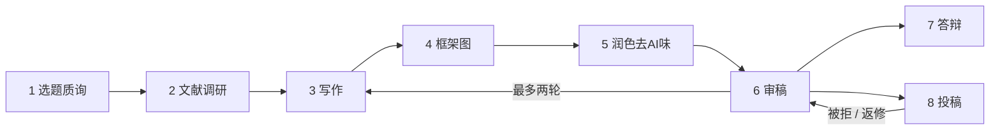

# paper-conductor 论文流水线总调度

> A pipeline conductor for academic paper writing. It does not write, polish, review, or draw figures itself. It tells you which stage you are in, which skill to use, and how to hand off between stages.
>
> 论文生产的调度台。它自己不写作、不润色、不审稿、不制图。它只判断你在哪个阶段、该用哪个 skill、上一步的产物怎么交给下一步。


## 为什么需要它

学术 skill 越来越多：调研的、写作的、制图的、去 AI 味的、审稿的、做答辩 PPT 的。每个都很强，但它们各自为战。真正写一篇论文时，难的往往不是某一步，而是：

- 我现在到底该用哪个？
- 上一个工具的产物怎么喂给下一个？
- 有没有一条从选题到投稿的完整路线？

paper-conductor 补的就是这层"编排"。它是地图和导航，不是某一段路。

## 它做什么 / 不做什么

| 做 | 不做 |
|---|---|
| 识别你所处的论文阶段 | 亲自写作 / 润色 / 审稿 / 制图 |
| 推荐该阶段的 skill + 触发例句 | 替你自动执行那些 skill |
| 给阶段间的 handoff（产物交接） | 取代任何被它调度的 skill |
| 给一条贯穿全程的路线图 | 在单一明确任务时抢触发 |

## 八个阶段



选题质询 → 文献调研 → 写作 → 框架图 → 润色去AI味 → 审稿 → 答辩 → 投稿。审稿后按意见回到写作或润色修订（最多两轮），投稿被拒或返修则回到审稿。

每阶段的识别信号、推荐 skill、输入输出、handoff，见 [`references/stage_cards.md`](references/stage_cards.md)。

## 安装

**方式一：作为 Claude Code plugin（推荐）**

```text
/plugin marketplace add jiayou20021120-afk/paper-conductor
/plugin install paper-conductor
```

**方式二：直接 clone 到 skills 目录**

```bash
git clone https://github.com/jiayou20021120-afk/paper-conductor.git ~/.claude/skills/paper-conductor
```

两种方式都会让它被任何 Claude Code 会话自动发现。用自然语言触发，例如："我要从头写一篇论文，给我一条路线图" 或 "这步做完了，下一步该用什么"。

## 怎么用

1. **定位阶段：** 它先判断你在 8 个阶段的哪一个（看你手上有什么产物）。
2. **给推荐：** 报出该阶段的默认 skill + 触发例句。
3. **给 handoff：** 说明这步产出什么、下一步需要什么、怎么交接。
4. **给路线图：** 要"全流程"时，给一条贯穿 1 到 8 的路线。

两个完整走查：

- [中文毕业论文，从项目到答辩](examples/zh_thesis_zero_to_defense.md)
- [英文期刊论文，从选题到投稿](examples/en_journal_submission.md)

## 默认栈可替换

paper-conductor 不绑定任何特定 skill 供应商。默认推荐填的是公开可得的主流学术 skill，你可以换成自己的，见 [`references/swappable_skills.md`](references/swappable_skills.md)。它只负责"按阶段路由"这个通用逻辑，不内嵌任何被推荐 skill 的代码。

## 致谢

paper-conductor 站在很多优秀的独立 skill 肩膀上。它只指向、不复制它们。感谢这些项目的作者：

- [academic-research-skills](https://github.com/Imbad0202/academic-research-skills)（Cheng-I Wu）：研究、写作、审稿、全流程编排
- [academic-writing-skills](https://github.com/bahayonghang/academic-writing-skills)（bahayonghang）：LaTeX/Typst 后期校对、本地文献检索、中文去 AI 味
- chinese-thesis-workbench（ZyhSechub）：中文毕业论文标准化交付
- paper-framework-figure-studio-pro（c-narcissus）：论文框架图
- [superpowers](https://github.com/obra/superpowers)、mattpocock skills、Anthropic skills：选题质询、文件操作等

如果你是上述某个 skill 的作者，希望调整本项目对你的描述或链接，欢迎提 issue。

## License

MIT。详见 [LICENSE](LICENSE)。本项目为原创，不包含任何被推荐 skill 的源码。
