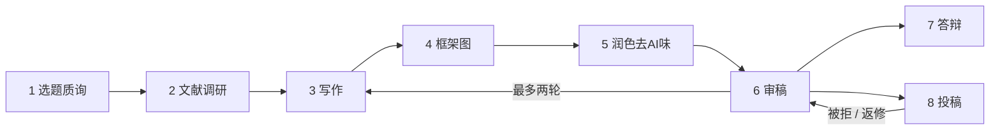

# paper-conductor 论文流水线总调度

> An all-in-one assistant and conductor for academic paper writing. It drafts, polishes, does a first-pass review, and plans the full route itself. When a stage has a stronger specialized skill, it recommends that skill and hands off. Both hands-on and orchestrating.
>
> 论文全程的集大成助手。它自己就能写、能润色、能做基础审稿、能给整条路线图。遇到有更强专门工具的环节，它会推荐那个 skill 并交接过去。既动手，也动嘴。


<p align="center">
  
</p>

## 为什么需要它

学术 skill 越来越多：调研的、写作的、制图的、去 AI 味的、审稿的、做答辩 PPT 的。每个都很强，但写一篇论文时，你常常不想为每一步都手动切换工具。

paper-conductor 是一个集大成的全程助手：

- 通用的写作、润色、基础审稿、路线规划，它直接帮你做。
- 遇到确实需要更强工具的环节（深度文献调研、框架图、中文破折号 hard gate、学校 DOCX 模板），它告诉你该用哪个专门 skill，并把产物交接过去。

它既是地图，也是车。能带你走，遇到需要专业装备的路段会告诉你换车。

## 两种模式并存

| 自己下场做 | 推荐并交接给更强的专门 skill |
|---|---|
| 写作：引言 / 方法 / 讨论 / 全文草稿 | 框架图 / 架构图（`paper-framework-figure-studio-pro`，需切 ChatGPT 出图） |
| 润色、表达改写、基础去 AI 味 | 中文破折号 / 引号 hard gate 级去 AI 味（`aiwei-zh`） |
| 基础审稿、自查、给修订意见 | 多 reviewer 深度评审（`academic-paper-reviewer` / `paper-audit`） |
| 选题质询、研究问题打磨 | 13-agent 系统性文献调研（`deep-research`） |
| 规划全程路线图、阶段定位、handoff | 学校模板 DOCX 交付（`chinese-thesis-workbench`）、本地 .bib 检索（`bib-search-citation`） |

判断原则：通用文本能力它自己干；需要专门引擎、外部工具、或硬规则的环节，推荐更强的 skill 并交接。

## 八个阶段



选题质询 → 文献调研 → 写作 → 框架图 → 润色去AI味 → 审稿 → 答辩 → 投稿。审稿后按意见回到写作或润色修订（最多两轮），投稿被拒或返修则回到审稿。

每阶段它自己能做什么、何时升级到专门 skill，见 [`references/stage_cards.md`](references/stage_cards.md)。

## 安装

**方式一：作为 Claude Code plugin（推荐）**

```text
/plugin marketplace add jiayou20021120-afk/paper-conductor
/plugin install paper-conductor
```

**方式二：直接 clone 到 skills 目录**

```bash
git clone https://github.com/jiayou20021120-afk/paper-conductor.git ~/.claude/skills/paper-conductor
```

两种方式都会让它被任何 Claude Code 会话自动发现。用自然语言触发，例如："帮我写引言"、"这段读起来太像 AI 了帮我清一遍"、"我要从头写一篇论文，给我一条路线图"。

## 怎么用

1. **定位阶段：** 它先判断你在 8 个阶段的哪一个（看你手上有什么产物）。
2. **能自己干就直接干：** 写作、润色、基础审稿、路线图，它直接动手。
3. **该升级时推荐升级：** 遇到有更强专门 skill 的环节，它告诉你用哪个，并交接产物。
4. **给路线图：** 要"全流程"时，给一条贯穿 1 到 8 的路线，标出哪些它自己做、哪些会升级。

两个完整走查：

- [中文毕业论文，从项目到答辩](examples/zh_thesis_zero_to_defense.md)
- [英文期刊论文，从选题到投稿](examples/en_journal_submission.md)

## 默认栈可替换

右列的专门 skill 是可替换的默认推荐，填的是公开可得的主流学术 skill，你可以换成自己的，见 [`references/swappable_skills.md`](references/swappable_skills.md)。paper-conductor 自己的写作 / 润色 / 审稿能力不依赖任何外部 skill。

## 致谢

paper-conductor 在需要更强工具的环节会推荐这些优秀的独立 skill。它只指向、不复制它们。感谢这些项目的作者：

- [academic-research-skills](https://github.com/Imbad0202/academic-research-skills)（Cheng-I Wu）：深度研究、12-agent 写作、多 reviewer 审稿、全流程编排
- [academic-writing-skills](https://github.com/bahayonghang/academic-writing-skills)（bahayonghang）：LaTeX/Typst 后期校对、本地文献检索、中文去 AI 味 hard gate
- chinese-thesis-workbench（ZyhSechub）：中文毕业论文标准化交付
- paper-framework-figure-studio-pro（c-narcissus）：论文框架图
- [superpowers](https://github.com/obra/superpowers)、mattpocock skills、Anthropic skills：选题质询、文件操作等

如果你是上述某个 skill 的作者，希望调整本项目对你的描述或链接，欢迎提 issue。

## License

MIT。详见 [LICENSE](LICENSE)。本项目为原创，不包含任何被推荐 skill 的源码。
